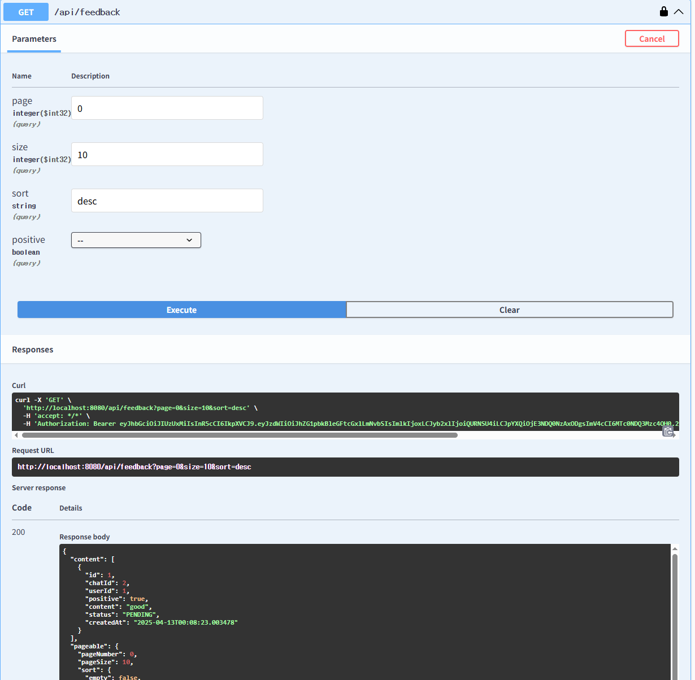
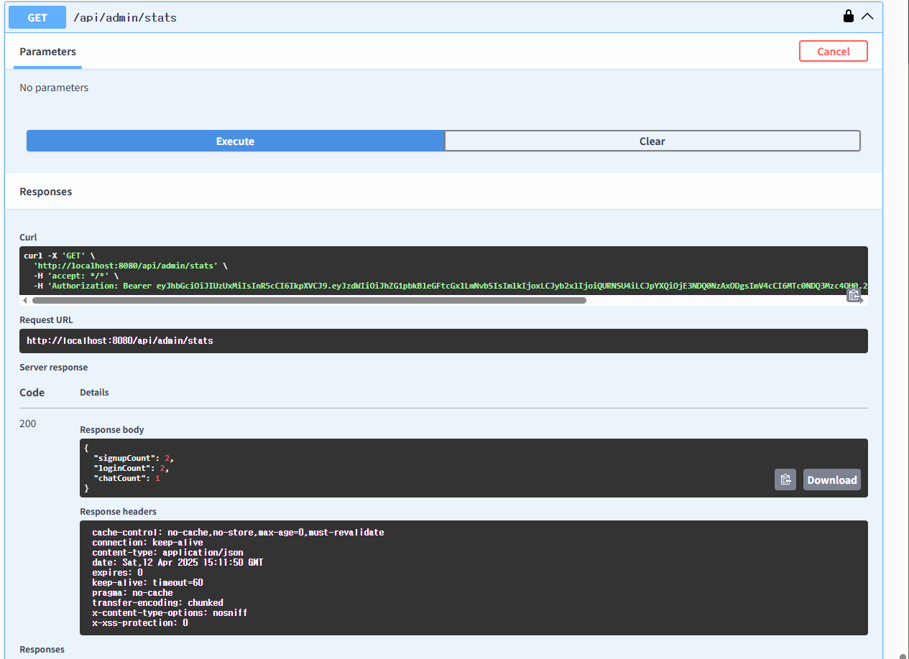

# ⚠️ 필수 설정 안내

이 프로젝트를 실행하기 위해서는 OpenAI API 키가 필요합니다.
`.env` 또는 `application.properties` 파일에 다음과 같이 설정해 주세요:

```properties
openai.api.key=YOUR_OPENAI_API_KEY
```

> 이 키는 깃허브에 포함되어 있지 않으며, 직접 발급받아 입력해야 API 호출이 정상 동작합니다.

---

# Sionic AI Chatbot Backend

이 프로젝트는 Kotlin + Spring Boot로 제작된 챗봇 백엔드 API 서버입니다.
OpenAI API 연동, 사용자 관리, 피드백, 관리자 통계 및 CSV 보고서 기능 등을 포함합니다.

> 본 문서에서는 API 테스트를 위한 Swagger 사용 방법과 역할(일반 사용자, 관리자)에 따른 시나리오를 안내드립니다.

## ✅ 실행 환경
- Kotlin 1.9.25
- Java 17
- Spring Boot 3.4.4
- H2 DB (in-memory)

---

## 🚀 실행 방법

### 1. 프로젝트 실행
```bash
./gradlew bootRun
```

> 실행 후 서버는 기본적으로 `http://localhost:8080` 에서 동작합니다.

---

### 2. Swagger API 문서 확인
- 주소: `http://localhost:8080/swagger-ui.html`
- 로그인/회원가입, 대화 생성, 피드백, 멤버 및 관리자 기능 모두 테스트 가능
- 로그인 후 Bearer Token을 오른쪽 상단 `Authorize` 버튼에 입력하여 인증 테스트 가능

> 권장: Swagger 창을 **두 개 열어**, 일반 사용자용과 관리자용 토큰을 따로 인증해 테스트하면 좋습니다.

---

### 3. 관리자 계정 정보 (초기 1회 자동 생성)
- 이메일: `admin@example.com`
- 비밀번호: `1234`

> 로그인 후 관리자 전용 통계 및 보고서 API 호출 가능

---

## 📘 주요 API 목록

## 🔐 **인증**
### - `POST /api/auth/signup`: 회원가입

  
### - `POST /api/auth/login`: 로그인 → JWT 토큰 발급

  

  
### 여기서 Token 값을 복사합니다.

  
### 오른쪽 상단의 Authorize를 클릭하여 해당 토큰 값을 입력하고 Authorize를 클릭합니다.
### 정확한 토큰 값이 입력되지 않으면 테스트가 불가능합니다.

## 💬 **대화**
### - `POST /api/chat`: 질문 전송 및 응답 저장

  
  
### - `GET /api/threads`: 자신의 스레드 목록 조회

  
### - `DELETE /api/threads/{id}`: 스레드 삭제

  

## 📝 **피드백**
### - `POST /api/feedback`: 피드백 생성 (중복 시 덮어쓰기)

  
### - `GET /api/feedback`: 피드백 목록 조회 (자신 또는 관리자)

  
### - `PATCH /api/feedback/{id}?status=RESOLVED`: 피드백 상태 변경 (관리자만)

  

## ⚙ **관리자 기능**
### - `GET /api/admin/stats`: 최근 하루 회원가입/로그인/대화 수

  
### - `GET /api/admin/report`: 최근 하루 대화 CSV 파일 다운로드

  

  

---

### 4. H2 Database 확인
- 주소: `http://localhost:8080/h2-console`
- JDBC URL: `jdbc:h2:mem:testdb`
- username: `sa`
- password: (비워두세요)

테이블 목록:
- USERS
- CHATS
- THREADS
- FEEDBACKS
- LOGIN_LOGS
- 💡 모든 테이블의 ID는 1부터 시작합니다.

---

### 5. 주요 기능 요약
- ✅ 사용자 회원가입 / 로그인 (JWT 기반)
- ✅ GPT 대화 API 호출 및 스레드/채팅 저장
- ✅ 피드백 등록/조회/상태변경 (사용자 + 관리자)
- ✅ 관리자 통계: 회원가입/로그인/대화 수
- ✅ 최근 하루치 대화 CSV 보고서 다운로드

---

## 💡 참고
- OpenAI 연동은 Swagger에서 `model`, `isStreaming` 파라미터로 조정 가능하지만,
  현재는 `model`을 `gpt-3.5-turbo`로 고정하였으며,
  Swagger 테스트에서는 `isStreaming` 기능은 사용할 수 없습니다.
  대신 일반 텍스트 응답만 처리되도록 구현되어 있습니다.
- 피드백은 각 사용자당 하나의 대화에 하나만 등록 가능하며, 중복 시 수정됨
- JWT 토큰은 로그인 성공 시 응답으로 반환됨

---